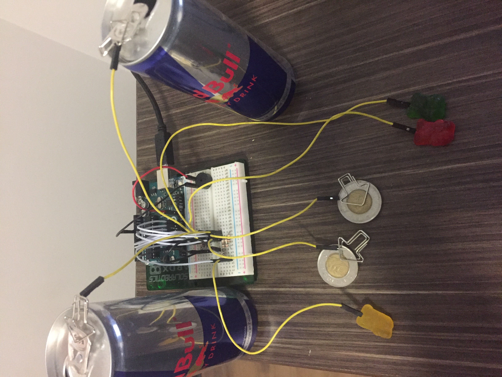

# CS207Project - Interactive Piano
This repository was made for the project in CS207 - Building Interactive Gadgets. 
This README will give instructions to how one might set-up an Interactive Piano with an Arduino Uno. 

The project involves building an Interactive Piano with different materials that you can find in your everyday home. 
Motivation for this project came when the authors friend showed some related work on YouTube. When watching the videos the author could see some possible improvements and fun ideas to add to these different projects. 

*Image 1: Image of the Interactive Piano*

In *Image 1* you can see how the project looks. Different tiles of the piano are represented by two Redbull cans, two 2$ coins and three gummy bears. 

# Repository Content
Here is a list of the content in the repository
* /InteractivePiano - In this folder you can find the code for this project.
  * InteractivePiano.ino 
* /images - Folder where all images for this README is stored.
* /README.md - Second content is the README.

# Requirements and Materials
For this project we needed to use a library to be able to input human touch.
* Capacitive Sensing Library - Library I used to create the sensors, can be found [here](https://playground.arduino.cc/Main/CapacitiveSensor?from=Main.CapSense) 

Below you can see a list of the required materials:
* Arduino Uno
* 7st 1M Ω resistors
* Piezo buzzer
* 2 Jumper wires for piezo buzzer
* 16 Jumper wires for the rest of the circuit
* The materials that you will attach to the touch sensors, in this case pop cans, coins and gummy bears

# Building Instructions
Here you can find instructions on how to build the circuit. 

The circuit is fairly easy to build. 
Below you can see the schematics of my build:

Picture of schematics here

# Usage
First the user needs to download the contents of this GitHub repository. After that follow the Building Intructions above to assemble the circuit. 
The code is farily simple and the different tresholds can be changed to another value if needed. For debugging purposes and to check the treshold values you can use the Seriell monitor to see the values of the different sensors. 

More detailed guide:
* Download contents of repository
* Open .ino file in Arduino IDE, can be found in folder InteractivePiano
* Assemble the circuit(See previous section)
* Upload code to Arduino
* Start playing your piano!

# Credits
Below you can see different related work that I used for my project:
* [MaKey MaKey – An Invention Kit for Everyone](https://www.youtube.com/watch?v=rfQqh7iCcOU) - Inspiration
* [Coke Piano and Launchpad made with Arduino](https://www.youtube.com/watch?v=Ttm62RBdOuo) - More inspiration
* [DIY Piano with Arduino](https://www.youtube.com/watch?v=X4QNT5hOHLs) - Code and Circuit build 
  * Code can be found [here](https://drive.google.com/drive/folders/0B4_2jFMdHQBjQ2dzS19Sc3NJTTQ) and circuit [here](https://drive.google.com/drive/folders/0B4_2jFMdHQBjUlozYXpVQXBoazg)
